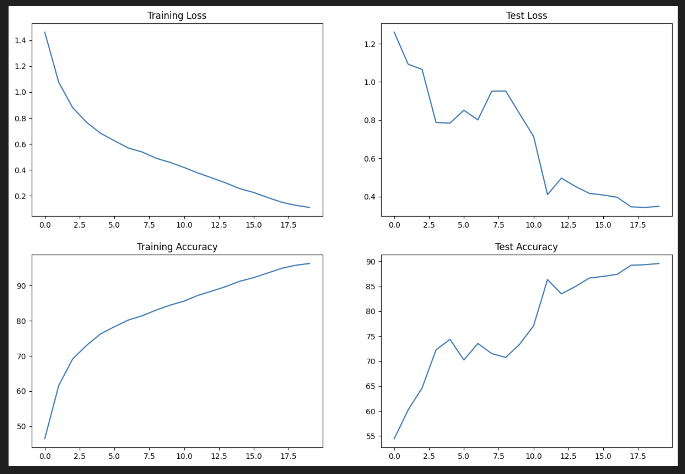
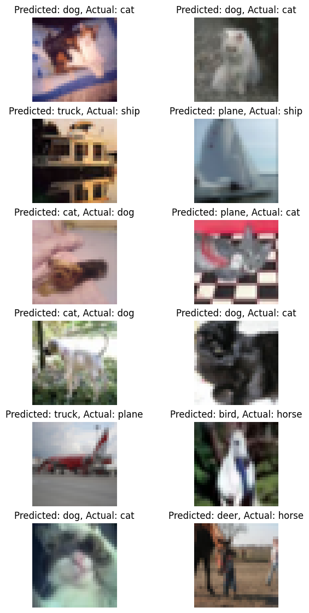
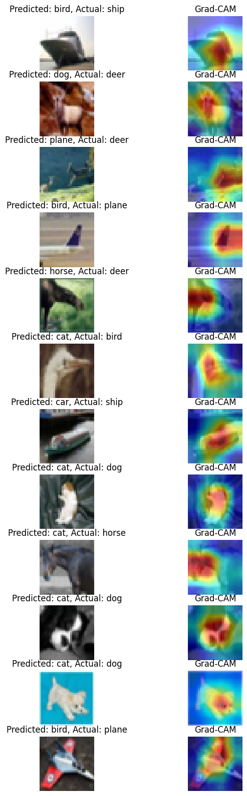

# ERA Session 11 :: CIFAR10 + GradCAM

Description: The CIFAR-10 dataset consists of 60000 32x32 colour images in 10 classes, with 6000 images per class. There are 50000 training images and 10000 test images.

## Overview

This repository contains the code for training a classifier on CIFAR10 dataset. The classifier is trained using ResNet and OneCycle Policy

Primary goal of this assignment is to use GradCAM to visualize the activations of the last convolutional layer of the model and the corresponding class predictions for the same.

Folder Structure
era-main : main repo with main, config, and utils 

├── utils.py # Plotting, training and test functions

├── models/resnet.py # Model definition

├── main.py # Main file to run the training and test


era-11: Has the usage notebook (minimal) and README and log files  

└── S11.ipynb.py # Main python notebook file with usage scripts

└── README.md # This file


## Getting Started

1. **Clone the repository**:

   ```bash
   git clone https://github.com/janakg/era-11.git

2. **Open the main Notebook in the Collab**

    ```bash
    https://colab.research.google.com/github/janakg/era-11/blob/main/S11.ipynb

3. **For local modules, we load the Github repo by cloning or pulling the code**


## Training
Run for 20 epochs with LR of 0.01 and Batch size of 512
Suggested LR: 2.54E-04




## Misclassified images



## Grad Cam

